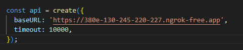

# Milton: Scan Art for Info. A Platform for Artist.

Named after 17th century poet John Milton, Milton is an app that helps you learn about art. Much of Miltons's work was written in completely in the dark, as he lost his sight in his 40s. Yet in his blindness, his work grew more vivid and imaginative. His magnum opus, Paradise Lost, is a testament to the power of art to transcend the physical world. Milton is designed to help you experience art in a new way, by providing audio descriptions of art pieces. All you need to do is scan a piece of art, and Milton will provide you with information about the art and an audio description if desired.

## Table of Contents

- [Installation](#installation)
- [Usage](#usage)
- [API](#api)

## Installation

To install this project, make sure you have android studio and yarn installed on your system. Clone the repository then install the dependencies using the following command in the root directory of this repository:
```bash
$ yarn install
```

## Usage
Configure the base URL in DescriptionScreen.tsx with the appropriate environment variable for the backend.
The backend server is found at [https://github.com/lai-kevin/SBU-Hackathon-2024-Server](https://github.com/lai-kevin/SBU-Hackathon-2024-Server)




## API

Access the API Documentation at [https://documenter.getpostman.com/view/30898740/2sA2r3Yk8w](https://documenter.getpostman.com/view/30898740/2sA2r3Yk8w)
